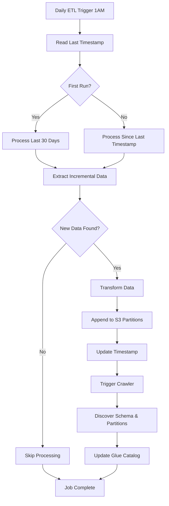

# Incremental ETL Processing - How It Works

## 🎯 Problem: Daily ETL with Only New Data

Your Glue ETL jobs implement **intelligent incremental processing** to handle only new/updated data each day, avoiding full table scans and reducing costs. Schema discovery is handled automatically by the Glue Crawler after ETL completion.

## 🔧 How Incremental Processing Works

### 1. **Timestamp-Based Filtering**
```sql
-- For Customers Table
SELECT * FROM customers 
WHERE created_at > 'last_processed_timestamp' 
   OR updated_at > 'last_processed_timestamp'

-- For Orders Table  
SELECT * FROM orders 
WHERE (order_date >= 'last_processed_date' AND order_date >= CURRENT_DATE - INTERVAL '7 days')
   OR updated_at > 'last_processed_timestamp'
```

### 2. **Metadata Tracking**
- **S3 Metadata Storage**: `s3://bucket/etl-metadata/table_name/last_processed_timestamp.txt`
- **Glue Job Bookmarking**: AWS Glue's built-in incremental processing
- **Automatic Timestamp Updates**: After each successful run

### 3. **Schema Discovery via Crawler**
- **Dynamic Schema**: Crawler automatically detects schema from Parquet files
- **Partition Discovery**: Automatically discovers year/month/day partitions
- **Schema Evolution**: Handles new columns and data type changes automatically

## 📊 Data Processing Flow



## 🗂️ Database Schema for Incremental Processing

### Tables with Timestamp Columns
```sql
-- Customers table
CREATE TABLE customers (
    customer_id SERIAL PRIMARY KEY,
    name VARCHAR(100),
    email VARCHAR(100),
    created_at TIMESTAMP DEFAULT CURRENT_TIMESTAMP,  -- For new records
    updated_at TIMESTAMP DEFAULT CURRENT_TIMESTAMP   -- For modifications
);

-- Orders table
CREATE TABLE orders (
    order_id SERIAL PRIMARY KEY,
    customer_id INTEGER,
    product_name VARCHAR(100),
    quantity INTEGER,
    price DECIMAL(10,2),
    order_date DATE DEFAULT CURRENT_DATE,            -- Business date
    updated_at TIMESTAMP DEFAULT CURRENT_TIMESTAMP   -- For modifications
);
```

### Automatic Timestamp Updates
```sql
-- Trigger to update updated_at on row changes
CREATE OR REPLACE FUNCTION update_updated_at_column()
RETURNS TRIGGER AS $$
BEGIN
    NEW.updated_at = CURRENT_TIMESTAMP;
    RETURN NEW;
END;
$$ language 'plpgsql';

CREATE TRIGGER update_customers_updated_at
    BEFORE UPDATE ON customers
    FOR EACH ROW
    EXECUTE FUNCTION update_updated_at_column();
```

## 📈 S3 Data Lake Structure

### Partitioned Storage (Crawler-Discovered)
```
s3://data-analytics-bucket/
├── customers/
│   ├── processing_year=2025/processing_month=07/processing_day=24/
│   │   ├── customers_20250724_010000.parquet      # Initial load
│   │   └── customers_20250725_010000.parquet      # Daily increment
│   └── processing_year=2025/processing_month=07/processing_day=25/
│       └── customers_20250725_010000.parquet      # Next day's changes
├── orders/
│   ├── year=2025/month=01/day=15/
│   │   ├── orders_20250724_010000.parquet         # Orders from Jan 15
│   │   └── orders_20250725_010000.parquet         # Updates to Jan 15 orders
│   └── year=2025/month=07/day=24/
│       └── orders_20250724_010000.parquet         # Current day orders
└── etl-metadata/
    ├── customers/
    │   └── last_processed_timestamp.txt            # "2025-07-24 01:05:23"
    └── orders/
        └── last_processed_timestamp.txt            # "2025-07-24 01:08:15"
```

### Glue Catalog (Auto-Created by Crawler)
```
Database: data_analytics_database
├── customers (table)
│   ├── Schema: customer_id, name, email, created_at, updated_at, etl_processed_at, etc.
│   └── Partitions: processing_year, processing_month, processing_day
└── orders (table)
    ├── Schema: order_id, customer_id, product_name, quantity, price, order_date, etc.
    └── Partitions: year, month, day
```

## 🔄 Testing Incremental Processing

### 1. **Initial Data Load & Schema Creation**
```bash
# Load sample data
python3 load_data.py $RDS_ENDPOINT analytics_db analytics_user ChangeMe123!

# Run complete pipeline (ETL + crawler)
python3 run_glue_jobs.py run-pipeline
```

### 2. **Simulate Daily Changes**
```bash
# Add new customers, orders, and updates
python3 simulate_incremental_data.py $RDS_ENDPOINT analytics_db analytics_user ChangeMe123!

# Run incremental ETL + schema update
python3 run_glue_jobs.py run-pipeline
```

### 3. **Manual Operations**
```bash
# Run just ETL jobs
python3 run_glue_jobs.py run-all

# Run just the crawler
python3 run_glue_jobs.py run-crawler data-analytics-crawler

# List all jobs and crawlers
python3 run_glue_jobs.py list
```

### 4. **Verify Schema Discovery**
```sql
-- Check tables created by crawler
SHOW TABLES IN data_analytics_database;

-- Check schema discovered from Parquet files
DESCRIBE customers;
DESCRIBE orders;

-- Verify partitions were discovered
SHOW PARTITIONS customers;
SHOW PARTITIONS orders;
```

## 🎯 Benefits of Crawler-Only Approach

### ✅ **Performance**
- **Faster Processing**: Only new/changed data
- **Lower Costs**: Reduced Glue DPU usage  
- **Efficient Queries**: Athena leverages discovered partitions
- **No Schema Conflicts**: Single source of truth from data

### ✅ **Reliability** 
- **Job Bookmarking**: Glue tracks processed data
- **Metadata Tracking**: S3-based timestamp storage
- **Append-Only**: Historical data preserved
- **Automatic Schema Updates**: Handles data evolution

### ✅ **Scalability**
- **Handles Growth**: Processes only deltas as data grows
- **Partition Pruning**: Athena queries only relevant partitions  
- **Concurrent Processing**: Multiple jobs can run safely
- **Schema Evolution**: New columns detected automatically

## 🔧 Advanced Configuration

### Customizing Incremental Logic
```python
# In etl_job_template.py, modify the incremental query:

# For CDC-enabled tables
def extract_with_cdc(table_name, connection_name, last_timestamp):
    query = f"""
    (SELECT *, 'INSERT' as change_type FROM {table_name} 
     WHERE created_at > '{last_timestamp}'
     UNION ALL
     SELECT *, 'UPDATE' as change_type FROM {table_name}_updates 
     WHERE updated_at > '{last_timestamp}'
    ) as cdc_data
    """
```

### Handling Large Updates
```python
# For tables with frequent updates, use micro-batches
def extract_micro_batch(table_name, connection_name, batch_size=10000):
    query = f"""
    (SELECT * FROM {table_name} 
     WHERE updated_at > '{last_timestamp}'
     ORDER BY updated_at 
     LIMIT {batch_size}
    ) as micro_batch
    """
```

## 🚨 Important Considerations

### **Data Consistency**
- ETL runs during low-activity hours (1 AM UTC)
- Uses database timestamps, not ETL processing time
- Handles timezone conversions properly

### **Error Handling**
- Failed jobs don't update timestamps
- Partial failures can be reprocessed
- Glue job bookmarking provides additional safety

### **Monitoring**
```bash
# Check last processed times
aws s3 cp s3://bucket/etl-metadata/customers/last_processed_timestamp.txt -

# Monitor job execution
python3 run_glue_jobs.py list
```

This incremental processing ensures your **daily ETL jobs are fast, cost-effective, and reliable** even as your data volume grows! 🚀
